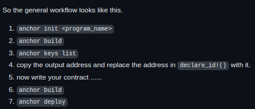

Start own testnet:
```
solana-test-validator
```

Change the api cluster:
```
solana config set --url localhost
```

See activity:
```
solana logs
```

init:
```
cargo init hello_world 
cargo add solana-program

anchor init hello_world
```

Build:
```
cargo build-bpf

anchor build
```

Deploy:
```
solana program deploy ./target/deploy/hello_world.so

anchor deploy
```

Local testnet explorer:
 https://explorer.solana.com/?cluster=custom&customUrl=http%3A%2F%2F127.0%3A8899

## Workflow 


https://github.com/coral-xyz/anchor/issues/1912

Get program_id:
```
anchor keys list
```

Add program_id to `/target/idl/hello_world.json`:
```json
,
"metadata":
{"address": "progam_id"}
```

Test contract:
```bash
anchor test 
 
#if you already have test-validator running
anchor run test
```
